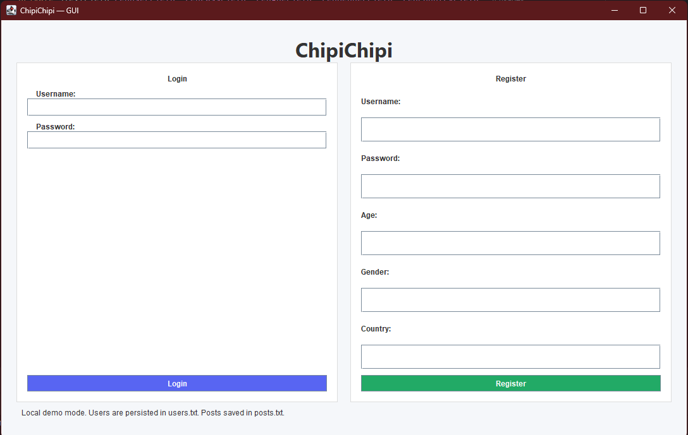
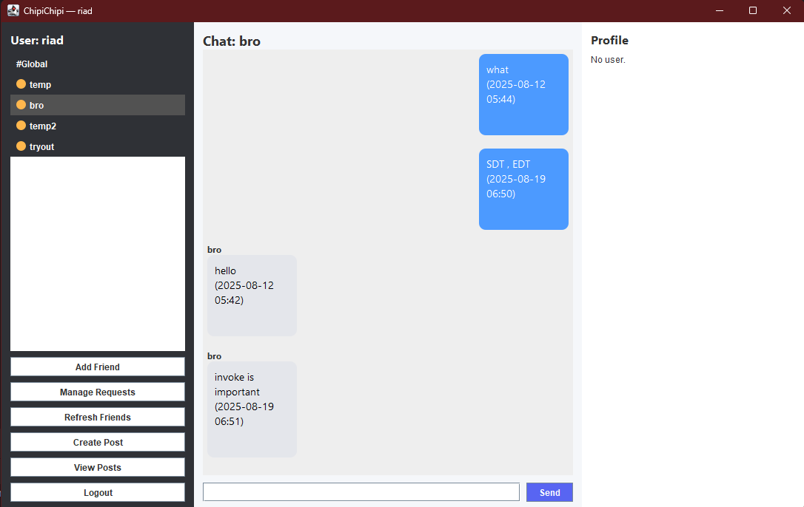

# ChipiChipi v2.0 — A Social Media Simulator

[](https://www.oracle.com/java/)
[]()
[]()
[](LICENSE)

ChipiChipi v2.0 is a **Java-based social media simulator** with a custom **Swing GUI** and **client–server socket communication**.  
It allows multiple users to connect, chat with friends, and simulate a small-scale messenger/social media experience.  

---

## ✨ Features
- 👥 **Login System** – User authentication through GUI.  
- 💬 **Private Messaging** – Send messages directly to friends.  
- 🌍 **Global Chat** – Talk with everyone in the connected network.  
- ➕ **Friend List Management** – Add and manage friends.  
- 🎨 **Modern GUI** – Styled with custom Swing components.  
- ⚡ **Real-time Communication** – Powered by Java sockets.  

---

## 📸 Screenshots  

### 🔑 Login Screen  
  

### 🏠 Main Menu / Chat Screen  
  

---

## 🚀 Getting Started

### 🔹 Prerequisites
- Java **17+** installed  
- Any Java IDE (**IntelliJ IDEA**, **Eclipse**, **VS Code**) or command-line tools  

---

### 🔹 Run from Command Line

**Compile:**
```
javac src/*.java
```
Start the server:
```
java src.ChipiChipiServer
```
In separate terminals, run multiple clients:
```
java src.ChipiChipiClientGUI
```
⚡ Always run the server first, then clients.
